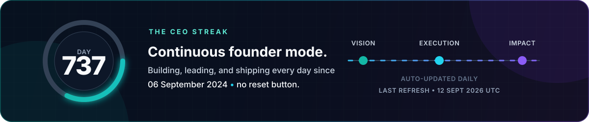
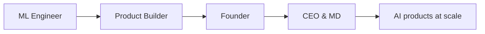
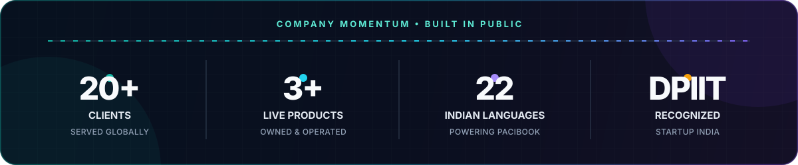

<div align="center">
  <a href="https://innovativus.in">
    <picture>
      <source media="(prefers-color-scheme: dark)" srcset="./assets/hero.svg" />
      <source media="(prefers-color-scheme: light)" srcset="./assets/hero-light.svg" />
      
    </picture>
  </a>
</div>

<div align="center">
  <a href="https://innovativus.in"></a>
  <a href="https://pacibook.com"></a>
  <a href="https://www.innovativus.in/prashant-mishra"></a>
</div>

<br />

<div align="center">
  <picture>
    <source media="(prefers-color-scheme: dark)" srcset="./assets/ceo-streak.svg" />
    <source media="(prefers-color-scheme: light)" srcset="./assets/ceo-streak-light.svg" />
    
  </picture>
</div>

## The founder's desk

I build at the intersection of **artificial intelligence, digital publishing, and consumer software**. My work has moved from training models to building companies around products that people can actually use.

- 🏢 **CEO & Managing Director** at [Innovativus Technologies](https://innovativus.in), a DPIIT-recognized AI-first technology company in New Delhi.
- 📚 **Founder of [Pacibook](https://pacibook.com)**, an AI-powered reading platform with instant translation across 22 Indian languages and in-context book Q&A.
- 🧠 Building production-grade **RAG pipelines, AI applications, SaaS platforms, DRM systems, and privacy-first infrastructure**.
- ✍️ Author of **AI in Social Media**, exploring how intelligent systems shape modern digital platforms.
- 🛠️ Still an engineer at heart: I like clean architecture, measurable outcomes, and products that survive contact with the real world.

## What I am building

<table>
  <tr>
    <td width="50%" valign="top">
      <h3>⚡ Innovativus Technologies</h3>
      <p>AI-first product engineering for companies that need speed, security, and measurable outcomes.</p>
      <p><strong>AI applications · Web & SaaS · Digital growth</strong></p>
      <a href="https://innovativus.in">Explore Innovativus →</a>
    </td>
    <td width="50%" valign="top">
      <h3>📖 Pacibook</h3>
      <p>An intelligent reading companion built for a multilingual India: read, translate, and ask questions without leaving the book.</p>
      <p><strong>22 Indian languages · RAG Q&A · DRM</strong></p>
      <a href="https://pacibook.com">Open Pacibook →</a>
    </td>
  </tr>
  <tr>
    <td width="50%" valign="top">
      <h3>🚀 Futurist-Files</h3>
      <p>A full-stack studio delivering modern web products, SaaS tools, SEO funnels, and growth campaigns.</p>
      <p><strong>Next.js · Product systems · Growth</strong></p>
      <a href="https://futurist-files.com">Visit the studio →</a>
    </td>
    <td width="50%" valign="top">
      <h3>🔐 Privacy-first infrastructure</h3>
      <p>Encryption-forward business email infrastructure with modern transport security, abuse controls, and practical operations.</p>
      <p><strong>DANE · MTA-STS · Privacy by design</strong></p>
      <a href="https://innovativus.in">Follow the build →</a>
    </td>
  </tr>
</table>

## My operating system

```text
01  Find a problem worth years, not weekends.
02  Design for people; architect for scale.
03  Put AI at the product's core, not on the landing page.
04  Ship the smallest honest version, then listen.
05  Turn every lesson into a better system.
```

## Current focus

<div align="center">


</div>

## From code to company



## Build signals

<div align="center">
  <picture>
    <source media="(prefers-color-scheme: dark)" srcset="./assets/build-signals.svg" />
    <source media="(prefers-color-scheme: light)" srcset="./assets/build-signals-light.svg" />
    
  </picture>
</div>

## Let's build something that matters

I am always interested in thoughtful conversations about **AI products, digital publishing, multilingual technology, and ambitious software businesses**.

<div align="center">
  <a href="https://www.linkedin.com/in/i-prashantmishra/"></a>
  <a href="https://www.instagram.com/Prashant.itpl"></a>
  <a href="https://innovativus.in/contact"></a>
</div>

<br />

<div align="center">
  <sub><strong>Building from New Delhi for the world.</strong></sub><br />
  <sub>CEO journey in motion since 06 September 2024.</sub>
</div>
